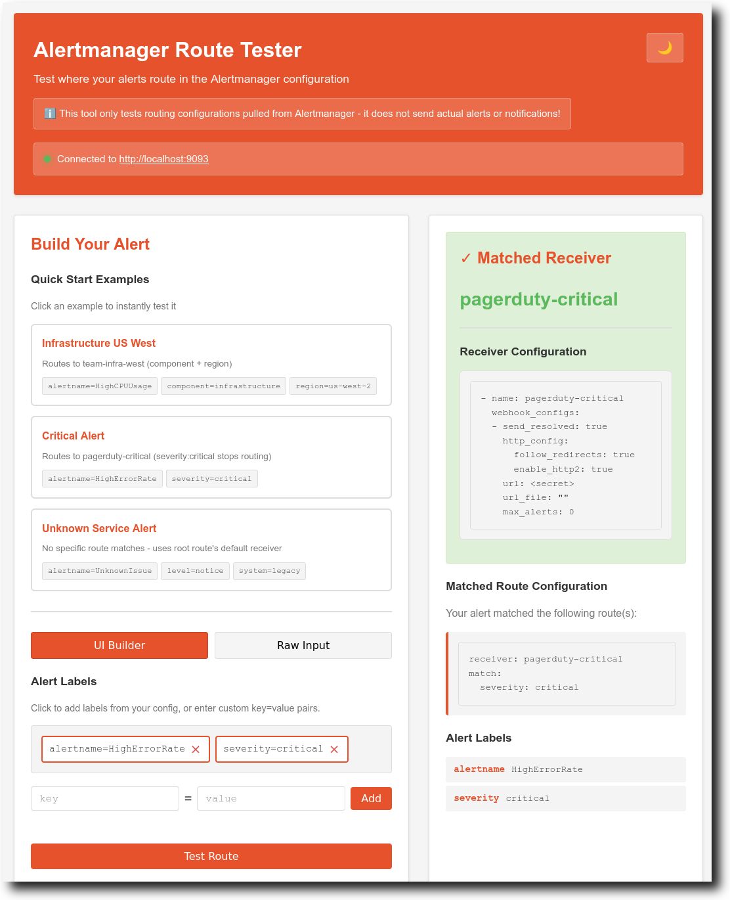
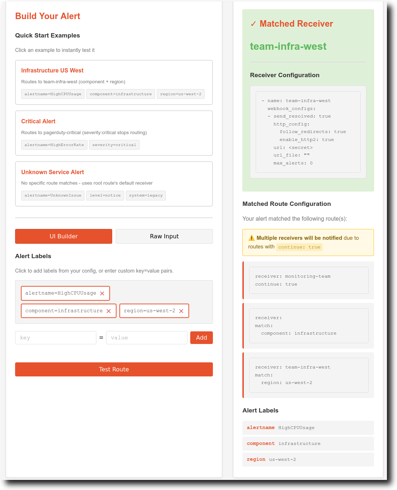

# Alertmanager Route Tester

Alertmanager Route Tester (ATR) is a web-app designed to help figure out where your Prometheus alerts will actually wind up given an Alertmanager configuration. It pulls Alertmanager's santizied configuration directly from an Alertmanager API and allows the user to see exactly what reciever(s) their alerts will route to.



Easily visualize complex alerting scenarions like `continue=true`:



## Usage

Create a `config.yaml` and point it at any Alertmanager instance:

```bash
go run .
```

Build your alert using the UI or paste YAML Prometheus alert labels. Hit "Test Route" to see which receiver it matches and the full route path.

### Configuration File

```yaml
alertmanager-route-tester:
  server:
    enabled: true
    listen: ":8080"
  cli-test-mode:
    enabled: false # set true to run in CLI test mode instead of web server mode
    format: "simple"
    labels: {} # required when cli-test-mode.enabled is true

alertmanager:
  url: "http://localhost:9093"
  http:
    tls:
      skip_verify: false
      ca_file: ""
      cert_file: ""
      key_file: ""
    timeouts:
      request: 15s
      dial: 5s
      tls_handshake: 5s
      response_header: 10s
      idle_conn: 90s
      expect_continue: 1s
  retry:
    max_attempts: 3
    backoff: 300ms
  pool:
    max_idle_conns: 100
    max_idle_conns_per_host: 10
    max_conns_per_host: 0
```

## CLI Test Mode

Run route tests from the command line using the exact same routing logic as the web UI.

```yaml
alertmanager-route-tester:
  server:
    enabled: false
  cli-test-mode:
    enabled: true
    format: "json"
    labels:
      alertname: "HighCPU"
      severity: "critical"
```

## Development

```bash
mise run # see all available mise tasks
mise run test   # run tests
mise run build  # build binary
mise run clean  # cleanup
```

### Local Development Environment

```bash
# locally, build and deploy ATR along with a local sample Alertmanager setup
mise run start
```

This command:

- Downloads and installs Alertmanager if needed
- Starts Alertmanager on http://localhost:9093
- Starts Route Tester on http://localhost:8080
- In the future can optional Docker compose setup would be nice

## How It Works

1. Fetches your Alertmanager config via Alertmanager's API.
2. Parses routing rules and matchers.
3. Evaluates your alert labels against the route tree.
4. Shows exactly which receiver(s) and route path matched.

Supports both exact matches and regex matchers, nested routes, default root reciever, and continue behavior.

## Planned Features

The following features are planned for future releases:

### Configuration File Support

- YAML Configuration: Replace CLI arguments with a dedicated `config.yaml` file
  - TLS Settings: Proper certificate configuration, custom CA support, mTLS authentication
  - Connection Options: Timeouts, retry policies, connection pooling

### Offline Mode

- Paste Config Support: Allow users to paste their own `alertmanager.yml` configuration directly into the UI
- Config Validation: Validate Alertmanager configurations before testing

### Enhanced UI

- Improved Multiple Receiver Display that has clearer visualization when alerts match multiple receivers due to `continue: true` routes
- Some kind of more interesting UI theme that is still clean and light
- We could add a trace view like vicmecs UI for the alert routing (idea for tomorrow)

### Go Code Architecture Improvements

- Interface-Based Design: Extract core routing logic into well-defined interfaces for better testability and extensibility
- Add proper context.Context support throughout the application for timeout handling and cancellation
- Use slog!
- Expand test coverage with comprehensive table-driven tests for all routing scenarios
  - Also try testcontainers-go for mocking an external Alertmanager
- Proper error handling with context using fmt.Errorf and error wrapping patterns

## About This Project

Built with Claude (claude-sonnet-4.5). See [agents.md](agents.md) for development details and AI assistance information.

- Claude Sonnet 4.5 (github-copilot/claude-sonnet-4.5)
- Skills Used: frontend-design, golang-pro
- Technologies: Go, HTMX
