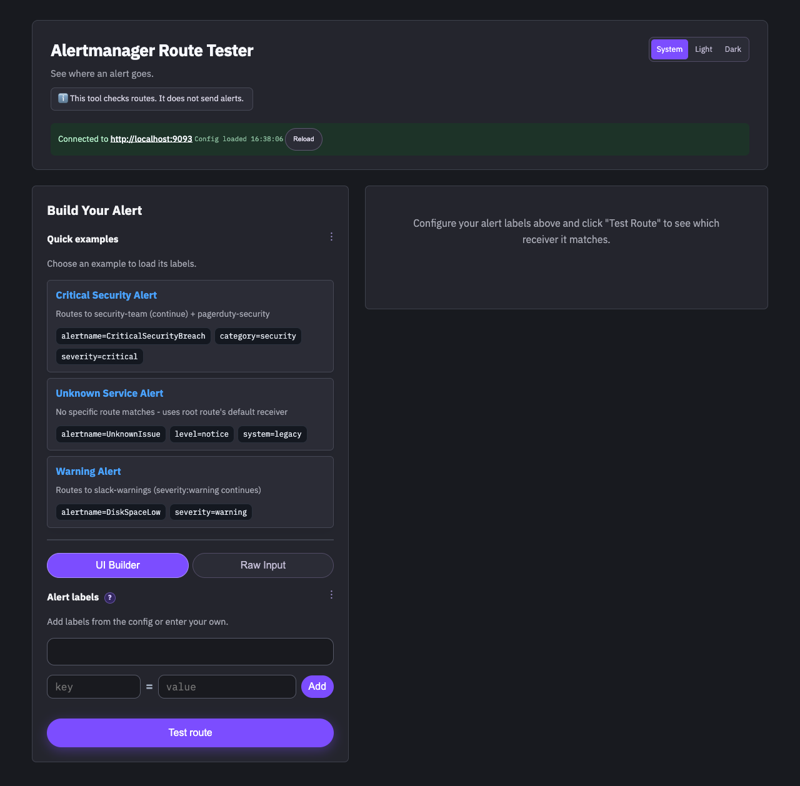
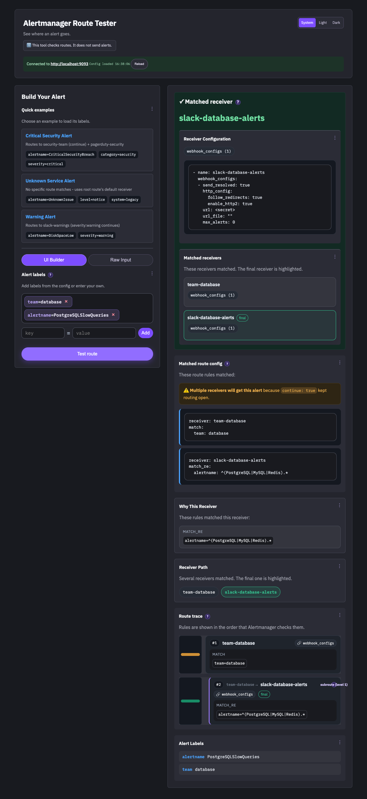

# Alertmanager Route Tester

Alertmanager Route Tester (ATR) is a web-app designed to help figure out where your Prometheus alerts will actually wind up given an Alertmanager configuration. It pulls Alertmanager's santizied configuration directly from an Alertmanager API and allows the user to see exactly what reciever(s) their alerts will route to.

### Browser UI

ATR uses a compact purple Qt-style layout in the browser. It has a system theme by default, with light and dark choices.





## Usage

Point it at any Alertmanager instance with `config.yaml`:

```bash
go run .
```

Build your alert using the UI or paste simple YAML-style `key: value` label lines. Hit "Test Route" to see which receiver it matches and the full route path.

### Configuration File

```yaml
alertmanager-route-tester:
  server:
    enabled: true
    listen: "127.0.0.1:8080"
  cli-test-mode:
    enabled: false # set true to run in CLI test mode instead of web server mode
    format: "simple"
    labels: {} # required when cli-test-mode.enabled is true

alertmanagers:
  production:
    url: "https://alerts.example.com"
    http:
      tls:
        skip_verify: false
        ca_file: ""
        cert_file: ""
        key_file: ""
      timeouts:
        request: 15s
        dial: 5s
        tls_handshake: 5s
        response_header: 10s
        idle_conn: 90s
        expect_continue: 1s
    retry:
      max_attempts: 3
      backoff: 300ms
    pool:
      max_idle_conns: 100
      max_idle_conns_per_host: 10
      max_conns_per_host: 0
  staging:
    url: "https://alerts-staging.example.com"
```

Each entry under `alertmanagers` has a name and URL. HTTP, TLS, retry, and connection-pool settings can be configured per instance. When more than one instance is configured, the web UI shows an Alertmanager selector above the connection status. Changing the selection reloads the route suggestions and uses that instance for route tests and config reloads.

The selected instance is not included in shareable label links. Shared links contain alert labels only, so opening one cannot change the configured Alertmanager connection.

### Local Alertmanager

If you are running Alertmanager locally (default port `9093`), set:

```yaml
alertmanagers:
  local:
    url: "http://localhost:9093"
```

### Local Config Overrides

For machine-specific settings, use a local config file (gitignored):

```bash
go run . -config config.local.yaml
```

## CLI Test Mode

Run route tests from the command line using the exact same routing logic as the web UI. CLI mode uses the lexicographically smallest named Alertmanager by default, or the instance selected with `-alertmanager`.

```yaml
alertmanager-route-tester:
  server:
    enabled: false
  cli-test-mode:
    enabled: true
    format: "json"
    labels:
      alertname: "HighCPU"
      severity: "critical"
```

For one-off tests, pass labels as JSON without editing the configuration file:

```bash
go run . -config config.yaml \
  -alertmanager production \
  -labels-json '{"alertname":"HighCPU","severity":"critical"}'
```

When `-labels-json` is omitted, CLI mode uses `cli-test-mode.labels` from the configuration. The `-alertmanager` flag is optional and must name one of the configured instances.

The HTMX browser dependency is bundled under `static/` and embedded in the binary, so running a built release does not require an internet connection for the UI.

## Development

```bash
mise run # see all available mise tasks
mise run test   # run tests
mise run build  # build binary
mise run clean  # cleanup
```

### Testing

The project includes comprehensive unit and integration tests:

#### Unit Tests

Run unit tests only (no external dependencies required):

```bash
go test -short ./...
```

Unit tests cover:
- Route matching logic (exact, regex, matchers)
- Edge cases (empty routes, deep nesting, special characters, unicode)
- Matcher parsing and validation
- Continue semantics and route evaluation order
- Config caching and invalidation

#### Integration Tests

Integration tests verify behavior against a real Alertmanager instance. When `ALERTMANAGER_URL` is unset, they use `localhost:9093` and skip cleanly when it is unavailable. When `ALERTMANAGER_URL` is set, an unavailable endpoint fails the tests instead of being skipped.

Run the full test workflow, including a managed Alertmanager instance:

```bash
mise run test
```

Run only unit tests without starting Alertmanager:

```bash
go test -short ./...
```

The CI workflow starts an isolated Alertmanager on port `19093` before running the full suite. `mise run test` uses the same isolated port locally, so it does not reuse an unrelated Alertmanager process on port `9093`.

Skip integration tests explicitly:

```bash
go test -short ./...
SKIP_INTEGRATION_TESTS=1 go test ./...
```

Integration tests cover:
- CLI test mode functionality
- Config caching with live API
- Complex routing scenarios with continue and nested routes

### Local Development Environment

```bash
# locally, build and deploy ATR along with a local sample Alertmanager setup
mise run start
```

This command:

- Downloads and installs Alertmanager if needed
- Starts Alertmanager on http://localhost:9093
- Starts Route Tester on http://localhost:8080
- In the future can optional Docker compose setup would be nice

## How It Works

1. Fetches your Alertmanager config via Alertmanager's API.
2. Parses routing rules and matchers.
3. Evaluates your alert labels against the route tree.
4. Shows exactly which receiver(s) and route path matched.

Supports both exact matches and regex matchers, nested routes, default root reciever, and continue behavior.

## Planned Features

The following features are planned for future releases:

### Offline Mode

- Paste Config Support: Allow users to paste their own `alertmanager.yml` configuration directly into the UI
- Config Validation: Validate Alertmanager configurations before testing

### Enhanced UI

- Try to display how the alert will actually look using the specific receiver configs/template
  - Note: This requires loading Alertmanager template files and implementing the full Alertmanager template function set. Without that, many configs reference external templates (e.g. `{{ template "..." }}`) that cannot be rendered from the API response alone.

### Go Code Architecture Improvements

- Interface-Based Design: Extract core routing logic into well-defined interfaces for better testability and extensibility
- Add proper context.Context support throughout the application for timeout handling and cancellation
- Add opentelemetry metrics/traces
- Proper error handling with context using fmt.Errorf and error wrapping patterns

### CI/misc

- GitHub Actions for automated tests/coverage/etc
- Update readme with fresh screenshots

## About This Project

Built with Claude (claude-sonnet-4.5). See [AGENTS.md](AGENTS.md) for development details and AI assistance information.

- Claude Sonnet 4.5 (github-copilot/claude-sonnet-4.5)
- Skills Used: frontend-design, golang-pro
- Technologies: Go, HTMX
