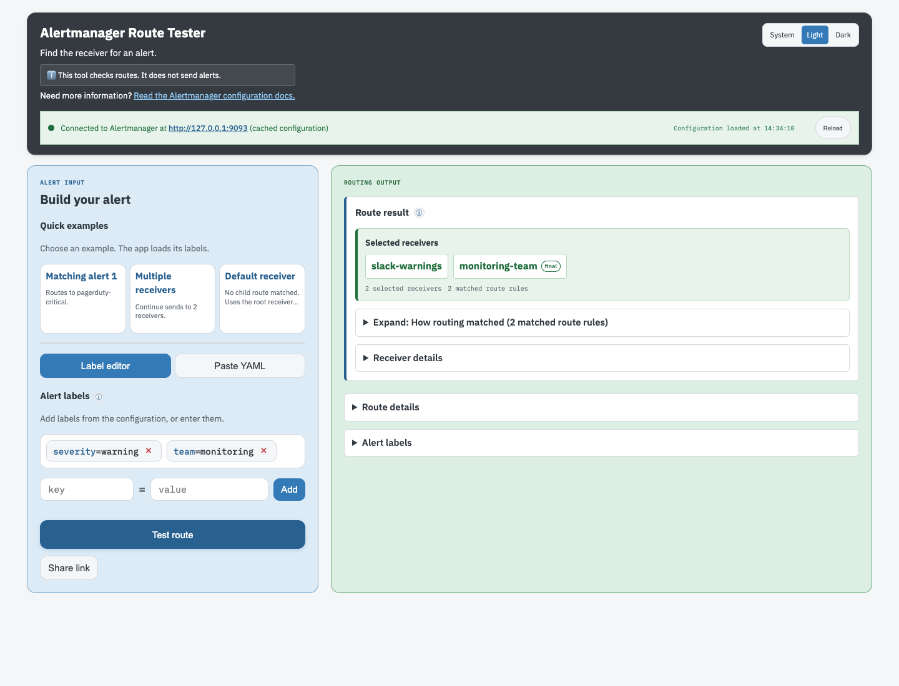

# Alertmanager Route Tester

Alertmanager Route Tester (ART) is a web app and CLI designed to help figure out where your Prometheus alerts will actually wind up in complex Alertmanager routes. It pulls Alertmanager's sanitized configuration directly from the Alertmanager API and allows the user to see exactly what receiver(s) their alerts will route to.

### Browser UI

ART has a two-pane browser UI. Blue marks alert input, and green marks selected receivers. The UI supports light and dark themes.



## Usage

Point it at any Alertmanager instance with `config.yaml`. ART supports multiple Alertmanager instances/clusters.

```bash
go tool otelc go run .
```

Build your alert using the UI or paste simple YAML `key: value` label lines. Hit "Test Route" to see which receiver it matches and the full route path.

### Configuration File

```yaml
alertmanager-route-tester:
  server:
    enabled: true
    listen: "127.0.0.1:8080"
  cli-test-mode:
    enabled: false # set true to run in CLI test mode instead of web server mode
    format: "simple"
    labels: {} # required when cli-test-mode.enabled is true

alertmanagers:
  production:
    url: "https://alerts.example.com"
    matcher_mode: "fallback"
    http:
      tls:
        skip_verify: false
        ca_file: ""
        cert_file: ""
        key_file: ""
      timeouts:
        request: 15s
        dial: 5s
        tls_handshake: 5s
        response_header: 10s
        idle_conn: 90s
        expect_continue: 1s
    retry:
      max_attempts: 3
      backoff: 300ms
    pool:
      max_idle_conns: 100
      max_idle_conns_per_host: 10
      max_conns_per_host: 0
  staging:
    url: "https://alerts-staging.example.com"
```

Each entry under `alertmanagers` has a name and URL. HTTP, TLS, retry, connection-pool, and matcher parsing settings can be configured per instance. Set `matcher_mode` to `fallback` (the default), `classic`, or `utf8-strict` to match the connected Alertmanager's `--enable-feature` mode. When more than one instance is configured, the web UI shows an Alertmanager selector above the connection status. Changing the selection reloads the route suggestions and uses that instance for route tests and config reloads. It is recommended to use multiple Alertmanagers only when configuring ART for multiple clusters, not for multiple Alertmanagers within the same cluster.

ART caches Alertmanager configuration with an option to reload the configuration.

Deploy ART behind the same authentication, network protection, and access controls as the Alertmanager it connects to. In general, its deployment boundary and public URL should match the protected boundary used for that Alertmanager rather than exposing ART directly. ART displays routing metadata and raw receiver configuration, which may contain sensitive endpoints or fields that Alertmanager does not redact.

The selected instance is not included in shareable label links. Shared links contain alert labels only, so opening one cannot change the configured Alertmanager connection.

### Container and Helm Deployment

Build the container locally with `docker build -t alertmanager-route-tester:local .`. The release workflow publishes version-tagged images to `ghcr.io/linode-obs/alertmanager-route-tester` on `v*` tags and publishes `latest` for stable tags. The GHCR package may require an `imagePullSecrets` entry unless its visibility is changed.

The reusable chart is in [`helm/alertmanager-route-tester`](helm/alertmanager-route-tester). It creates a ClusterIP Service and a default-deny ingress NetworkPolicy. Configure trusted ingress sources and an Alertmanager endpoint in a values file before installing. The chart runs as non-root, uses CPU and memory requests, and sets no resource limits. See the chart README for TLS Secret mounts and install values. See [`docs/opentelemetry.md`](docs/opentelemetry.md) for Collector and OTLP configuration.

```bash
helm upgrade --install alertmanager-route-tester \
  ./helm/alertmanager-route-tester \
  --namespace alertmanager-route-tester \
  --create-namespace \
  -f values.yaml
```

### Local Alertmanager

If you are running Alertmanager locally (default port `9093`), set:

```yaml
alertmanagers:
  local:
    url: "http://localhost:9093"
```

### Local Config Overrides

For machine-specific settings, use a local config file (gitignored):

```bash
go tool otelc go run . -config config.local.yaml
```

## CLI Test Mode

Run route tests from the command line using the exact same routing logic as the web UI. CLI mode uses the alphabetically first named Alertmanager by default, or the instance selected with `-alertmanager`.

```yaml
alertmanager-route-tester:
  server:
    enabled: false
  cli-test-mode:
    enabled: true
    format: "json"
    labels:
      alertname: "HighCPU"
      severity: "critical"
```

For one-off tests, pass labels as JSON without editing the configuration file:

```bash
go tool otelc go run . -config config.yaml \
  -alertmanager production \
  -labels-json '{"alertname":"HighCPU","severity":"critical"}'
```

When `-labels-json` is omitted, CLI mode uses `cli-test-mode.labels` from the configuration. The `-alertmanager` flag is optional and must name one of the configured instances.

The HTMX browser dependency is bundled under `static/` and embedded in the binary, so running a built release does not require an internet connection for the UI.

## Development

```bash
mise run # see all available mise tasks
mise run test   # run tests
mise run build  # build binary
mise run clean  # cleanup
```

### Testing

The project pins Alertmanager 0.33.0 in `go.mod`, `.mise.toml`, the CI workflow, and the parity test version check. Update these pins together.

The project includes unit and integration tests:

#### Unit Tests

Run unit tests only (no external dependencies required):

```bash
go test -short ./...
```

Unit tests cover:
- Route matching logic (exact, regex, matchers)
- Edge cases (empty routes, deep nesting, special characters, unicode)
- Matcher parsing and validation
- Continue semantics and route evaluation order
- Config caching and invalidation

#### Integration Tests

Integration tests verify behavior against a real Alertmanager instance. When `ALERTMANAGER_URL` is unset, they use `localhost:9093` and skip cleanly when it is unavailable. When `ALERTMANAGER_URL` is set, an unavailable endpoint fails the tests instead of being skipped.

Run the full test workflow, including a managed Alertmanager instance:

```bash
mise run test
```

Run only unit tests without starting Alertmanager:

```bash
go test -short ./...
```

The CI workflow starts an isolated Alertmanager on port `19093` before running the full suite. `mise run test` uses the same isolated port locally, so it does not reuse an unrelated Alertmanager process on port `9093`. It also runs an `otelc` test that checks incoming-to-outgoing trace propagation.

Skip integration tests explicitly:

```bash
go test -short ./...
SKIP_INTEGRATION_TESTS=1 go test ./...
```

Integration tests cover:
- CLI test mode functionality
- Config caching with live API
- Complex routing scenarios with continue and nested routes

### Local Development Environment

```bash
# locally, build and deploy ART along with a local sample Alertmanager setup
mise run start
```

This command:

- Downloads and installs Alertmanager if needed
- Starts Alertmanager on http://localhost:9093
- Starts Route Tester on http://localhost:8080
- In the future can optional Docker compose setup would be nice

## Releasing

Pushing a `v*` tag runs `.github/workflows/release.yaml`. GoReleaser builds the binaries and creates the GitHub Release, then the workflow publishes the multi-arch image to `ghcr.io/linode-obs/alertmanager-route-tester`.

1. Merge the changes to `main` and confirm CI passes.
2. Choose the next version with [svu](https://github.com/caarlos0/svu), which reads the conventional commits since the last tag:

   ```bash
   git checkout main && git pull --ff-only
   svu next                      # preview the version
   git tag "$(svu next)"
   git push origin "$(svu next)"
   ```

3. Watch the Release workflow. A stable tag like `v0.1.0` publishes `0.1.0` and `latest`. A prerelease tag containing `-` publishes only its version.
4. Set the GHCR package visibility to public after the first publish, or deployments need an `imagePullSecrets` entry.

Run these checks before tagging:

```bash
goreleaser check
goreleaser release --snapshot --clean --skip=publish
docker build -t alertmanager-route-tester:local .
```

## How It Works

1. Fetches your Alertmanager config via Alertmanager's API.
2. Parses routing rules and matchers.
3. Evaluates your alert labels against the route tree.
4. Shows exactly which receiver(s) and route path matched.

Supports both exact matches and regex matchers, nested routes, default root receiver, and continue behavior.

## Planned Features

The following features are planned for future releases:

### Offline Mode

- Paste Config Support: Allow users to paste their own `alertmanager.yml` configuration directly into the UI
- Config Validation: Validate Alertmanager configurations before testing

### Enhanced UI

- Try to display how the alert will actually look using the specific receiver configs/template
  - Note: This requires loading Alertmanager template files and implementing the full Alertmanager template function set. Without that, many configs reference external templates (e.g. `{{ template "..." }}`) that cannot be rendered from the API response alone.

### Go Code Architecture Improvements

- Interface-Based Design: Extract core routing logic into well-defined interfaces for better testability and extensibility
- Add proper context.Context support throughout the application for timeout handling and cancellation
- Add opentelemetry metrics/traces
- Proper error handling with context using fmt.Errorf and error wrapping patterns

### CI/misc

- GitHub Actions for automated tests/coverage/etc
