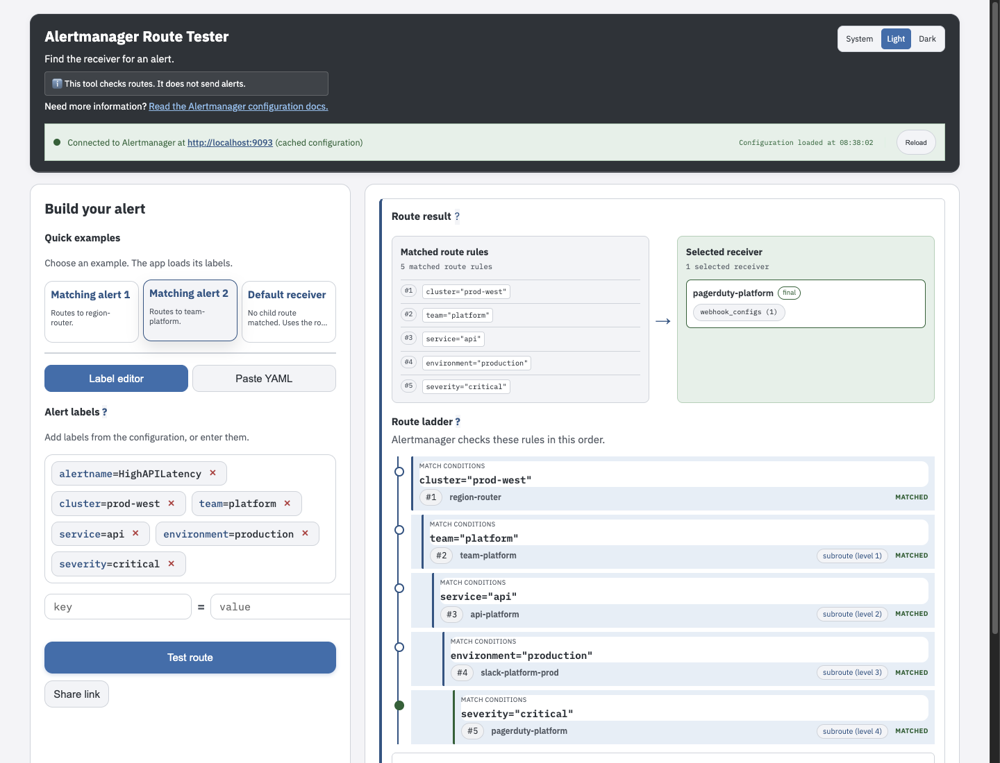
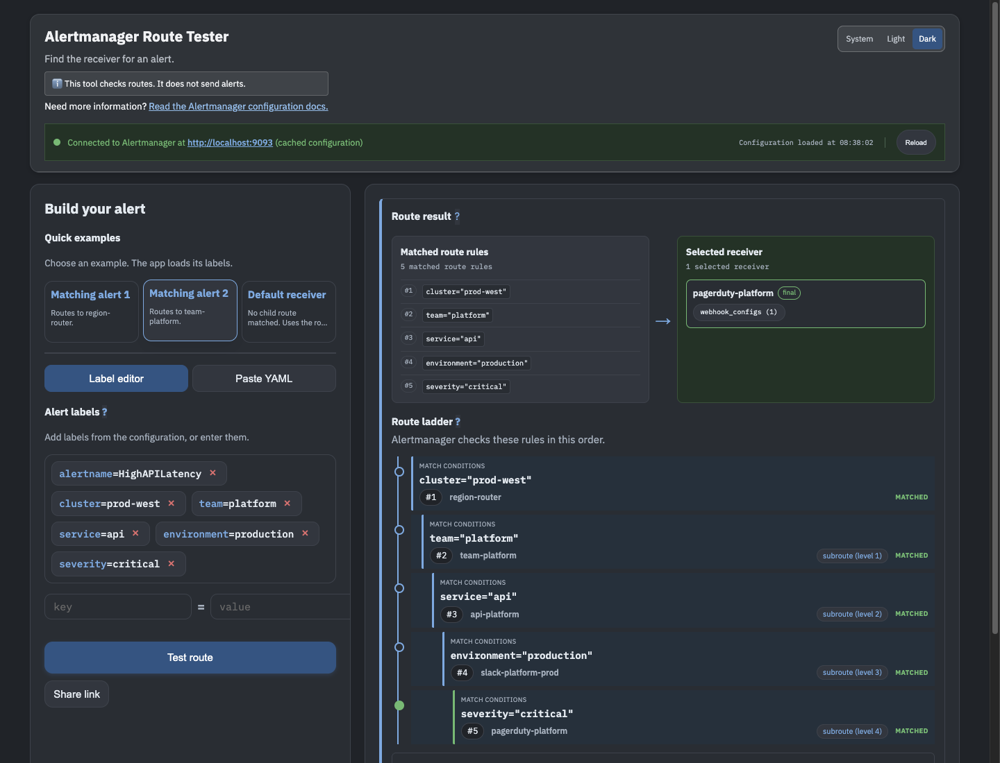

AI-generated content prepared on Will's behalf.

# Issue #14 route-ladder design reference

This static preview records the selected route-ladder direction. It includes five layout options, light and dark themes, and simulated label, route-test, and share states. Its CSS and interactions are embedded in `route-ladder-preview.html`. It sends no requests to Alertmanager.

The preview opens on the tested route-ladder state. Use its controls to compare the other layouts, themes, and action states. The light and dark screenshots below show the running app with a local five-level Alertmanager route and the route-to-receiver flow. The remaining action-state screenshots are from the static preview.

Use this as a visual guide for future frontend work:

- Keep the tested route result beside the alert inputs on wide screens.
- Show matched route rules flowing to the selected receiver or receivers before the route ladder.
- Give long route paths enough room to read each matcher and receiver.
- Use blue and gray for the interface, with green marking matched routes.
- Show each matcher condition before its receiver name.
- Keep configuration details available without competing with the route path.

Light theme:

Dark theme:

Static preview action states: `label-added.png`, `route-tested.png`, and `link-shared.png`.
